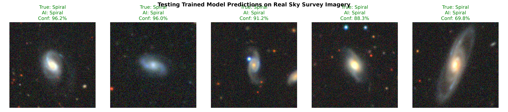
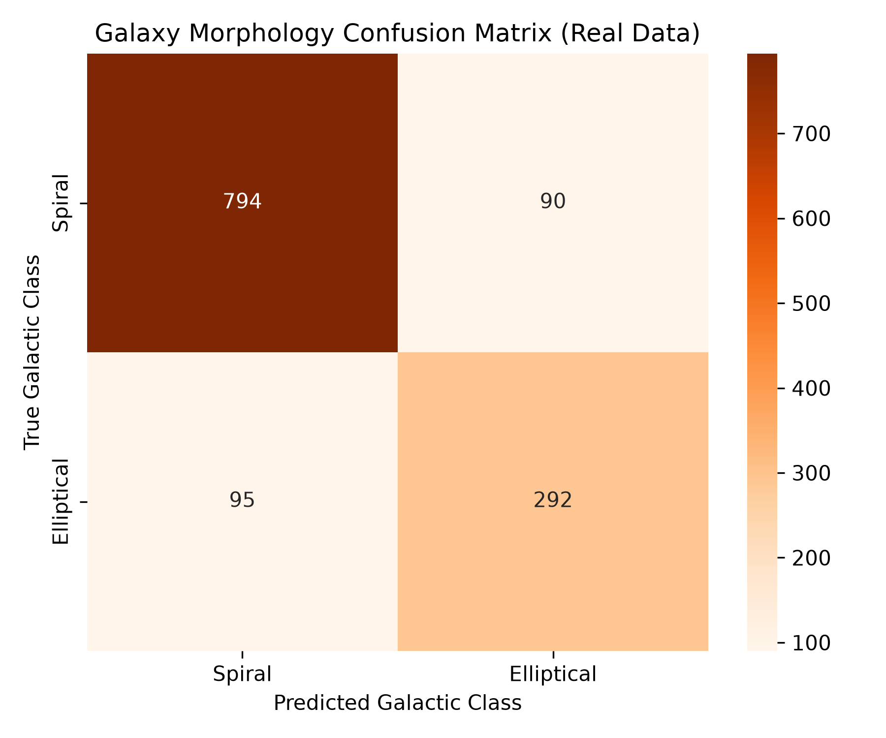

# 🪐 Deep Space Galaxy Morphology Classifier (PyTorch CNN)

A computer vision project that processes raw sky-survey data to recognize and categorize deep-space galaxies based on their structural profiles.

## 📊 Scientific Objectives & Data Engineering
- **Database:** Sloan Digital Sky Survey (SDSS via AstroNN), processing **6,354 active training images**.
- **The Core Problem:** High-granularity telescope imagery features severe target imbalance (Spirals overrepresented 2.3× against Ellipticals).
- **Mathematical Optimization:** Implemented custom **Weighted Cross-Entropy Loss** to heavily penalize minority group misclassification errors, boosting balanced macro-averages.

## 📈 Model Performance & Metrics
- **Overall Accuracy:** `85.00%` 
- **Balanced Generalization:** Spiral F1-Score: `0.90` | Elliptical F1-Score: `0.76` (Successfully corrected underfitting on complex features).

### 1. Trained Model Predictions Grid
Below is the output showing a sample batch of real galaxies alongside our network's localized prediction confidences:

### 2. Performance Heatmap
Below is the performance heat-map tracking our final optimized model's classifications across unseen data:

## 🛠️ Tech Stack & Architecture Specifications
- **Framework Core:** PyTorch 2.0+ (CPU-Optimized Local Environment)
- **Feature Extraction Layers:** Conv2D blocks integrated with BatchNorm2d, ReLU activations, and MaxPool2d downsampling.
- **Classification Engine:** Fully Connected Linear Classifier Layers integrated with a Dropout layer (`0.40` value) to penalize memorization.
- **Optimization Strategy:** Weighted Cross-Entropy Loss optimization evaluated using the Adam algorithm.
